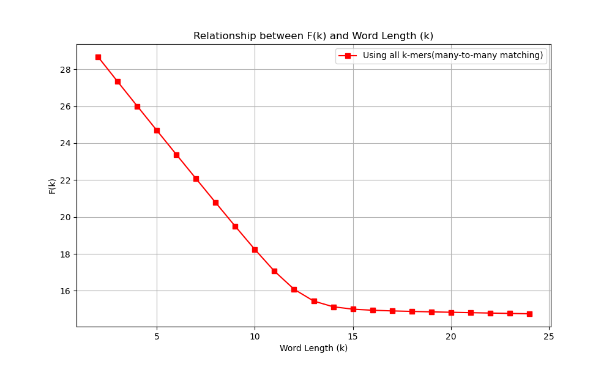

# RY-SlopeSearch
## Introduction
Here is the source code of RY-SlopeSearch, which is a slope-based alignment-free algorithm for fast DNA sequence comparison.

All ranking results of RY-SlopeSearch are publicly available on the AFproject website. You can find them by searching for the keyword `RY-SlopeSearch-v1.0.0` on the AFproject website.

If you want to see the introduction of the slope-based model (including mathematical principles), please check the section "Core Model" in this README.md, which is next to the section "Getting Started".

## Getting Started
### Requirements
- GCC 12.3.0 or higher
- CMake: Version 3.20 or higher
- third party (included as a git submodule under `third_party/`)
  - SeqAn3 Library: Used for FASTA parsing
- OpenMP: Optional, but if enabled, it requires a compatible OpenMP installation for parallel processing support

### Installation
```shell
git clone --recursive git@github.com:UTokyoChenYe/RY-SlopeSearch.git
cd RY-SlopeSearch
mkdir build && cd build
cmake -DCMAKE_BUILD_TYPE=Release -DCMAKE_C_COMPILER=/usr/bin/gcc-12 -DCMAKE_CXX_COMPILER=/usr/bin/g++-12 ..
make
```

If you cloned the repository without `--recursive`, fetch the submodules before building:
```shell
git submodule update --init --recursive
```

To build without OpenMP, add `-DUSE_OPENMP=OFF` to the `cmake` command.

*ignore `warning: use of ‘std::hardware_destructive_interference_size’`*

### Usage
```shell
RY-SlopeSearch -i <input_dir> -o <output_dir> [options]
```

| Option | Description |
|--------|-------------|
| `-i`, `--input DIR` | **Required.** Directory containing the `.fasta` files to compare. |
| `-o`, `--output DIR` | **Required.** Output root directory. It is created if it does not exist. |
| `-m`, `--method NAME` | Sampling word set. Default: `start_ry_128_matches`. |
| `--many-to-many` | Use many-to-many matching instead of the default one-to-one matching. |
| `--background` | Subtract the expected number of background matches. Default: off. |
| `-t`, `--threads N` | Number of threads. Default: all available threads. |
| `--no-progress` | Disable the progress bar. |
| `-h`, `--help` | Print the help message and exit. |
| `-v`, `--version` | Print the version and exit. |

- `.fasta` files are collected recursively under the input directory
- each `.fasta` file has one genome
- supported word sets (`--method`):
  - `basic_kmer_matches`: all k-mers
  - `start_ry_matches`: RY word set
  - `start_ry_4_6_matches`: RY 4-6 word set
  - `start_ry_4_9_matches`: RY 4-9 word set
  - `start_ry_16_matches`: RY16-11 word set
  - `start_ry_32_matches`: RY32-11 word set
  - `start_ry_64_matches`: RY64-13 word set
  - `start_ry_128_matches`: RY128-12 word set
- output: a timestamp folder is created under the output directory, containing
  - `run_parameters.txt`: the command line and all parameters used
  - runtime log
  - `.phy` distance matrix (PHYLIP format)
  - `performance_info.log`: time of matrix computation

### How to run an example
- Example Data: `RY-SlopeSearch/example/example_data/assembled-ecoli` (29 assembled E. coli/Shigella genomes)

#### Step 1: Run the program
From the project root:
```shell
./build/RY-SlopeSearch -i example/example_data/assembled-ecoli -o example/example_output
```

#### Step 2: Check the result
All results are in a timestamp folder under `example/example_output`.

#### Step 3: Upload the `.phy` file to the AFproject website
You can upload the `.phy` file of the example data to [AFproject-benchmark-E.coli](https://afproject.org/app/benchmark/genome/std/assembled/ecoli/) to check nRF/nQD and your ranking.


## Core Model
### Slope-based Sequence Algorithm
Slope-based methods estimate sequence similarity by analyzing how the number of shared $k$ -mers changes as the $k$ -mer length $k$ increases.

The key observation is that, within homologous regions, the number of shared $k$ -mers decays approximately exponentially as $k$ increases. Therefore, the slope of the log-transformed match count is directly related to sequence similarity.

Let:
- $N_k$ be the observed number of $k$ -mer matches, including both homologous matches and background matches;
- $E(B_k)$ be the expected number of background matches;
- $p$ be the per-site match probability;
- $L_h$ be the effective length of homologous regions.

When $L_h \gg k$, the homologous component of the match count can be approximated by $L_h p^k$. Therefore, the expected number of observed matches can be written as:

$$
E(N_k) \approx L_h p^k + E(B_k)
$$

After subtracting the expected background matches, we define:

$$
F(k) := \log(E(N_k)-E(B_k))
$$

Then:

$$
F(k) \approx \log(L_h) + k\log(p)
$$

This means that $F(k)$ is approximately linear in $k$, and its slope is:

$$
\text{slope} = \log(p)
$$

Thus, the sequence similarity can be estimated as:

$$
p = e^{\text{slope}}
$$

In practice, the range of $k$ values used for slope estimation is determined by empirical formulas.

For phylogenetic reconstruction, the estimated similarity $p$ can be converted into an evolutionary distance using a nucleotide substitution model such as Jukes-Cantor (JC69):

$$
d = -\frac{3}{4}\log\left(1-\frac{4}{3}(1-p)\right)
$$

The resulting distance can then be used to construct a phylogenetic tree.

### Empirical Determination of the $k$ -Range for Slope Estimation

The slope of $F(k)$ is estimated over a restricted interval of $k$ values. Selecting an appropriate range is important: for small $k$, background matches dominate and introduce noise, whereas for large $k$, the number of observed matches becomes sparse.

In our implementation, the interval is determined by an empirical formula based on the average sequence length, following Slope-SpaM.

Let

$$
L_{\mathrm{avg}} = \frac{L_1 + L_2}{2}
$$

denote the average length of the two sequences, and let $\ell$ denote the pattern length. For full $k$ -mers, $\ell = 1$ .

We define

$$
k_{\min}=\max\left(\left\lceil\frac{\log(L_{\mathrm{avg}}) + 0.69}{0.875}\right\rceil,\ell\right)
$$

and

$$
k_{\max}=\max\left(\left\lfloor\frac{\log(L_{\mathrm{avg}})}{0.634}\right\rfloor,\ell\right).
$$

These constants are taken from the Slope-SpaM paper. The slope is then fitted using all integer values

$$
k \in [k_{\min}, k_{\max}].
$$

### $F(k)$ Curve for Word Lengths $k$

We used two sequences, *Shigella dysenteriae* Sd197 and *Escherichia coli* UTI89, to generate the $F(k)$ curve for word lengths $k$. This curve provides a visualization of $F(k)$ and helps illustrate the slope-based method.



**Figure:** Relationship between $F(k)$ and word length $k$ for $k \in [2, 24]$, computed for *Shigella dysenteriae* Sd197 and *Escherichia coli* UTI89. The curve was generated using all $k$ -mers and many-to-many matching.


## Contact
If you have any questions, please feel free to leave a message to me!
